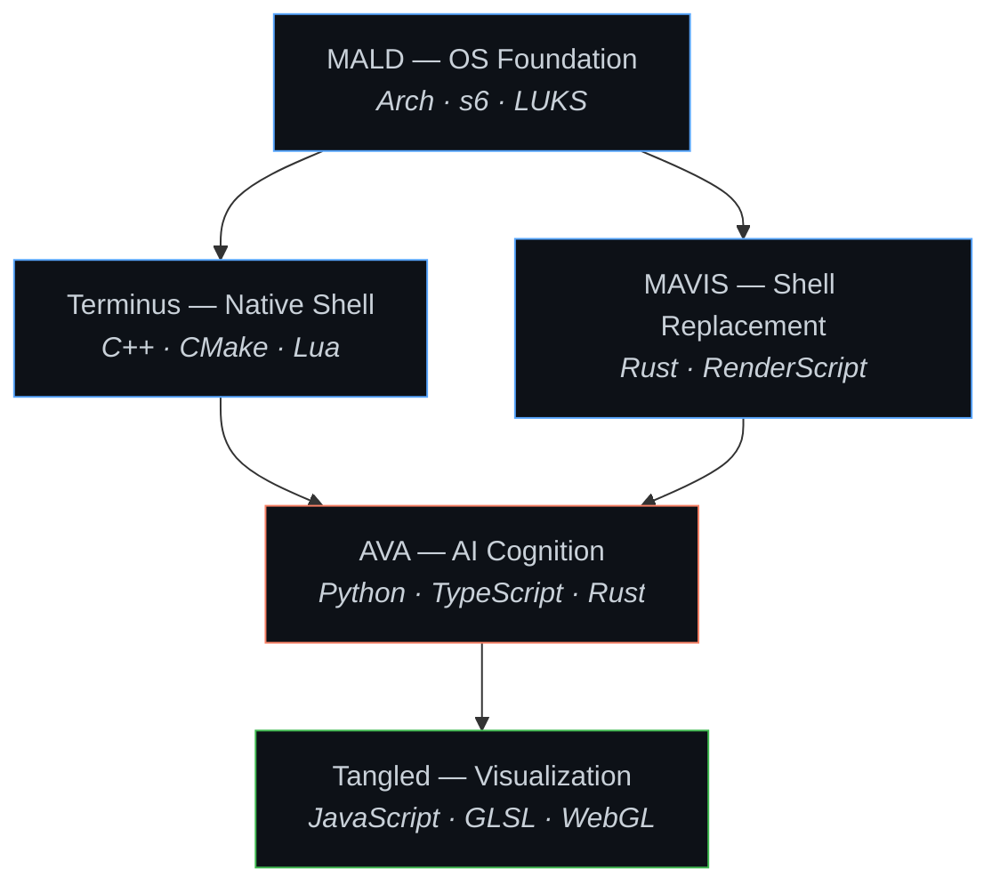

<!-- Animated Header GIF -->

  

<h1 align="center">Afsah</h1>

  

  <a href="https://github.com/NAME0x0/MALD">MALD</a> · <a href="https://github.com/NAME0x0/Terminus">Terminus</a> · <a href="https://github.com/NAME0x0/MAVIS">MAVIS</a> · <a href="https://github.com/NAME0x0/AVA">AVA</a> · <a href="https://github.com/NAME0x0/Tangled">Tangled</a>

  
  

---

Building sovereign computing environments — from custom OS init systems to native shell replacements to local-first AI assistants. Pursuing BSc (Hons) IT at Middlesex University Dubai.

---

## The Sovereign Stack

| Layer | Project | Core Tech | What It Does |
|:------|:--------|:----------|:-------------|
| **Foundation** | [MALD](https://github.com/NAME0x0/MALD) | Arch, s6, LUKS | Custom Linux distribution with encrypted sovereign boot |
| **Interface** | [Terminus](https://github.com/NAME0x0/Terminus) | C++, CMake | Desktop-replacing terminal environment for Windows |
| **Interface** | [MAVIS](https://github.com/NAME0x0/MAVIS) | Rust | Full Windows shell replacement |
| **Intelligence** | [AVA](https://github.com/NAME0x0/AVA) | Python, TypeScript, Rust | Local-first AI assistant with RAG and LLM orchestration |
| **Visualization** | [Tangled](https://github.com/NAME0x0/Tangled) | JavaScript, GLSL | Quantum-entangled multi-window 3D browser experiences |

---

## Capabilities Matrix

| Domain | Skills |
|:-------|:-------|
| **Systems Programming** | Kernel-level encryption, custom init orchestration (s6), manual memory management (C/C++), Rust ownership patterns |
| **AI / ML Engineering** | Local RAG pipelines, LLM orchestration, PyTorch/TensorFlow model training, CUDA/ROCm acceleration |
| **Shell & OS Design** | Windows shell replacement, terminal UI architecture, Lua scripting integration, LUKS full-disk encryption |
| **Web & Visual** | GLSL shader programming, WebGL multi-window rendering, full-stack TypeScript, responsive CSS systems |
| **DevOps & Tooling** | Docker/Kubernetes, CMake build systems, CI/CD pipelines, cross-platform batch/shell/PowerShell automation |

---

## Languages

  

---

## Core Tools

---

## Current Focus

<!--START_SECTION:focus-->
No focus set.
<!--END_SECTION:focus-->

---

## Recent Activity

<!--START_SECTION:activity-->
1. ❌ Closed PR [#2](https://github.com/NAME0x0/MALD/pull/2) in [NAME0x0/MALD](https://github.com/NAME0x0/MALD)
2. ❌ Closed PR [#4](https://github.com/NAME0x0/Tangled/pull/4) in [NAME0x0/Tangled](https://github.com/NAME0x0/Tangled)
<!--END_SECTION:activity-->

---

## Coding Profile

  

  
  

  
  

---

## Stats

  

  

  

---

## Contribution Graph

  

---

  <a href="mailto:m.afsah.279@gmail.com">m.afsah.279@gmail.com</a> · <a href="https://www.linkedin.com/in/muhammad-afsah-mumtaz/">LinkedIn</a>

---

<!--START_SECTION:quote-->

  

<!--END_SECTION:quote-->

  

  

