<!-- ASCII profile card — regenerated daily by refresh.yml -->

  <a href="https://github.com/NAME0x0">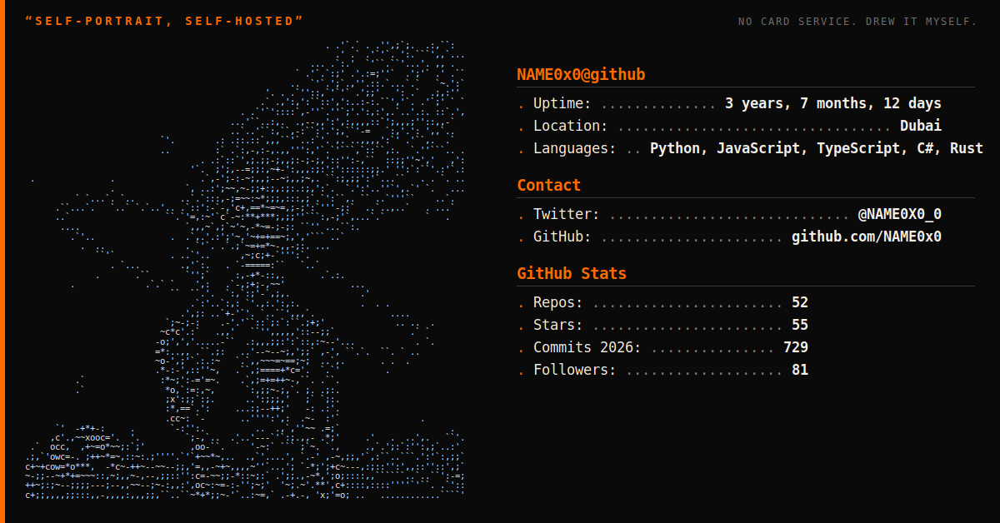</a>

<!-- Brand header — animated, self-hosted -->

  

  

**Muhammad Afsah Mumtaz** (NAME0x0) — AI engineer in Dubai building local-first systems: LLM fine-tuning and evaluation, multi-agent orchestration, and the Rust/C++ tools and shell environments around them. Every claim below links to running code. BSc (Hons) IT, Middlesex University Dubai. Reach me: [m.afsah.279@gmail.com](mailto:m.afsah.279@gmail.com)

  

  

  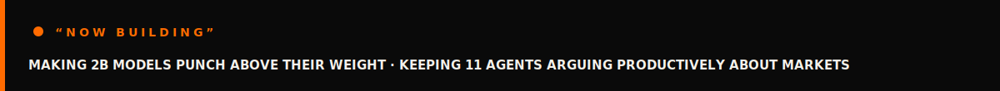

## The Work

  <a href="https://github.com/NAME0x0/Pantheon-Trades">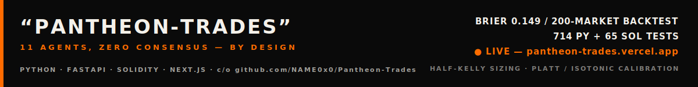</a>

  <a href="https://github.com/NAME0x0/AVA">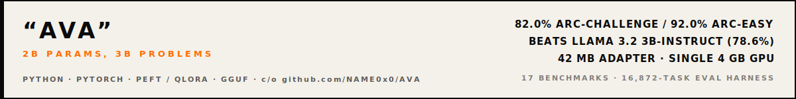</a>

  <a href="https://github.com/NAME0x0/MALD">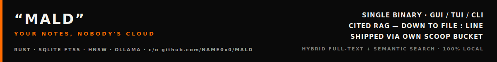</a>

  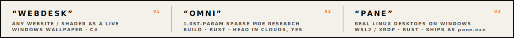

**Workshop overflow:** [WebDesk](https://github.com/NAME0x0/WebDesk) · [OMNI](https://github.com/NAME0x0/OMNI) · [pane](https://github.com/NAME0x0/pane) · [MAVIS](https://github.com/NAME0x0/MAVIS) — scriptable Windows shell replacement · [Terminus](https://github.com/NAME0x0/Terminus) — terminal that ate the desktop · [neural-nets](https://github.com/NAME0x0/neural-nets) — train a network in your browser, six chapters · [AGI-Ledger](https://github.com/NAME0x0/AGI-Ledger) — a permanent record of human belief about AGI

  

## Live Telemetry

  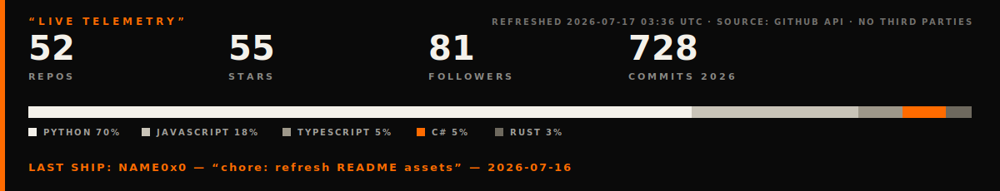

  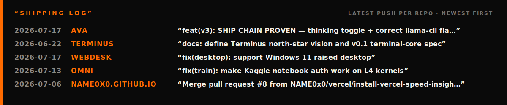

  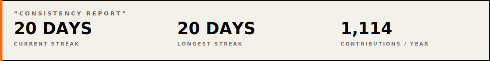

## Capabilities

| Domain | Skills |
|:-------|:-------|
| **AI / ML Engineering** | LoRA/QLoRA fine-tuning, model evaluation & benchmarking, RAG pipelines, multi-agent orchestration, quantized inference (GGUF), model serving — PyTorch, Hugging Face, Ollama |
| **Backend & Data** | FastAPI, Node.js, REST API design, PostgreSQL, Redis, SQLite FTS5, vector search (HNSW) |
| **Blockchain** | Solidity, Foundry, on-chain settlement (Arc Testnet), Polymarket CLOB integration |
| **Native Systems & UI** | Rust and C++ application architecture, Windows shell design, terminal-first UX |
| **Web & Real-Time** | Next.js, React, Three.js, WebGL, Socket.IO, shader-driven visual systems |
| **Tooling & Delivery** | Docker, GitHub Actions CI/CD, CMake and Cargo workflows, cross-platform scripting, release packaging |

  

  

  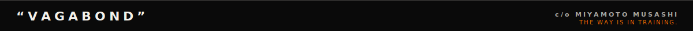

## Beyond the Repos

- 🏆 **2× hackathon runner-up** — Odoo Hackathon Dubai · Curtin University Dubai (Nov 2025)
- 🪑 **Chairman, MDX Computing Society** · **Committee Chair, BCS Student Chapter**
- 🔬 Occasional open-source research — [HAGI](https://github.com/ShmidtS/HAGI)

  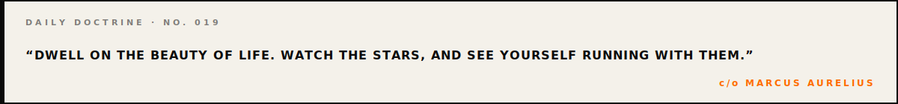

  

  

  

  <a href="mailto:m.afsah.279@gmail.com">m.afsah.279@gmail.com</a> · <a href="https://www.linkedin.com/in/muhammad-afsah-mumtaz/">LinkedIn</a> · <a href="https://NAME0x0.github.io">Portfolio</a> · <a href="https://pantheon-trades.vercel.app">Pantheon Live</a>

  

  BUILT BY HAND. NO TEMPLATE. <em>"YOU MADE IT TO THE BOTTOM."</em>

