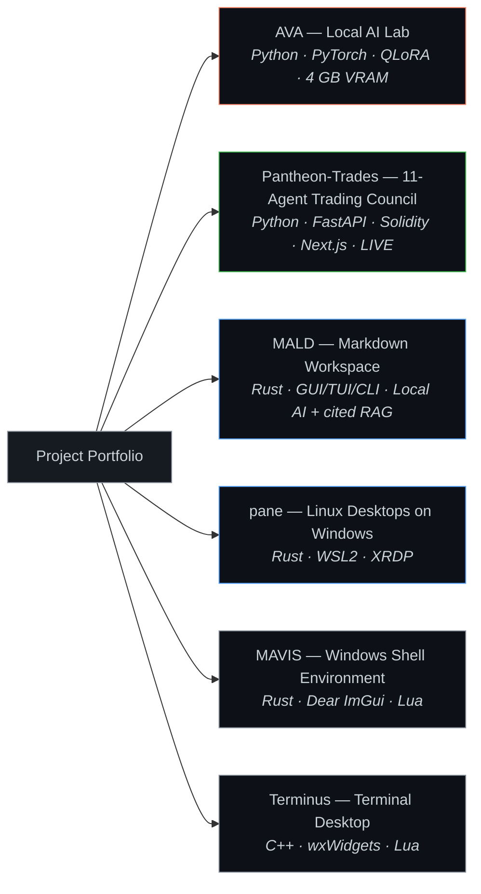

<!-- Animated Header GIF -->

  

<h1 align="center">Afsah</h1>

  

  <a href="https://github.com/NAME0x0/AVA">AVA</a> · <a href="https://github.com/NAME0x0/Pantheon-Trades">Pantheon-Trades</a> · <a href="https://github.com/NAME0x0/MALD">MALD</a> · <a href="https://github.com/NAME0x0/pane">pane</a> · <a href="https://github.com/NAME0x0/MAVIS">MAVIS</a> · <a href="https://github.com/NAME0x0/Terminus">Terminus</a>

  
  

---

Building local-first AI systems — fine-tuning, evaluation, multi-agent orchestration — and the knowledge tools and shell environments around them. Every claim below links to running code. BSc (Hons) IT at Middlesex University Dubai.

> 📌 **Open to AI / ML / Software Engineering internships and junior roles** — Dubai / Abu Dhabi or remote · UAE Golden Visa (no sponsorship needed) · immediate start · [m.afsah.279@gmail.com](mailto:m.afsah.279@gmail.com)

---

## The Sovereign Stack

```mermaid
flowchart LR
    A["Project Portfolio"] --> E["AVA — Local AI Lab<br/><i>Python · PyTorch · QLoRA · 4 GB VRAM</i>"]
    A --> P["Pantheon-Trades — 11-Agent Trading Council<br/><i>Python · FastAPI · Solidity · Next.js · LIVE</i>"]
    A --> B["MALD — Markdown Workspace<br/><i>Rust · GUI/TUI/CLI · Local AI + cited RAG</i>"]
    A --> N["pane — Linux Desktops on Windows<br/><i>Rust · WSL2 · XRDP</i>"]
    A --> D["MAVIS — Windows Shell Environment<br/><i>Rust · Dear ImGui · Lua</i>"]
    A --> C["Terminus — Terminal Desktop<br/><i>C++ · wxWidgets · Lua</i>"]

    style A fill:#161b22,stroke:#8b949e,color:#c9d1d9
    style E fill:#0d1117,stroke:#f78166,color:#c9d1d9
    style P fill:#0d1117,stroke:#3fb950,color:#c9d1d9
    style B fill:#0d1117,stroke:#58a6ff,color:#c9d1d9
    style N fill:#0d1117,stroke:#58a6ff,color:#c9d1d9
    style D fill:#0d1117,stroke:#8b949e,color:#c9d1d9
    style C fill:#0d1117,stroke:#8b949e,color:#c9d1d9
```

| Layer | Project | Core Tech | Receipts |
|:------|:--------|:----------|:---------|
| **AI Research** | [AVA](https://github.com/NAME0x0/AVA) | Python, PyTorch, PEFT/QLoRA, GGUF | Fine-tuned a 2B LLM to **82.0% ARC-Challenge / 92.0% ARC-Easy** — beating Llama 3.2 3B-Instruct (78.6%) — with a 42 MB adapter on a single 4 GB GPU. 17-benchmark, 16,872-task eval harness. |
| **Multi-Agent** | [Pantheon-Trades](https://github.com/NAME0x0/Pantheon-Trades) | Python, FastAPI, Solidity, Next.js | **Live:** [pantheon-trades.vercel.app](https://pantheon-trades.vercel.app) — 11 LLM agents debate every prediction-market trade. Half-Kelly sizing, Platt/isotonic calibration, **Brier 0.149** on a 200-market backtest, 714 Python + 65 Solidity tests. |
| **Knowledge** | [MALD](https://github.com/NAME0x0/MALD) | Rust, SQLite FTS5, HNSW, Ollama | Single-binary PKM: hybrid full-text + semantic search, cited RAG chat down to exact file and line. Fully local. |
| **Environments** | [pane](https://github.com/NAME0x0/pane) | Rust, WSL2, XRDP, PowerShell | Real Linux desktops on Windows — create, launch, repair from one control surface. Arch-first MVP shipped as `pane.exe`. |
| **Interface** | [MAVIS](https://github.com/NAME0x0/MAVIS) | Rust, Dear ImGui, Lua | Scriptable Windows shell replacement: terminal, editor, widgets, system monitor in one environment. |
| **Interface** | [Terminus](https://github.com/NAME0x0/Terminus) | C++, wxWidgets, Lua | Windows terminal environment replacing the desktop with widgets, search, and file workflows. |

---

## Capabilities Matrix

| Domain | Skills |
|:-------|:-------|
| **AI / ML Engineering** | LoRA/QLoRA fine-tuning, model evaluation & benchmarking, RAG pipelines, multi-agent orchestration, quantized inference (GGUF), model serving — PyTorch, Hugging Face, Ollama |
| **Backend & Data** | FastAPI, Node.js, REST API design, PostgreSQL, Redis, SQLite FTS5, vector search (HNSW) |
| **Blockchain** | Solidity, Foundry, on-chain settlement (Arc Testnet), Polymarket CLOB integration |
| **Native Systems & UI** | Rust and C++ application architecture, Windows shell design, terminal-first UX |
| **Web & Real-Time** | Next.js, React, Three.js, WebGL, Socket.IO, shader-driven visual systems |
| **Tooling & Delivery** | Docker, GitHub Actions CI/CD, CMake and Cargo workflows, cross-platform scripting, release packaging |

---

## Languages

  

---

## Core Tools

---

## Beyond the Repos

- 🔬 **Open-source research contributor — [HAGI](https://github.com/ShmidtS/HAGI):** Clifford-algebra reasoning in small language models (PyTorch, Rust, Lean4)
- 🏆 **2× hackathon runner-up** — Odoo Hackathon Dubai · Curtin University Dubai (Nov 2025)
- 🪑 **Chairman, MDX Computing Society** · **Committee Chair, BCS Student Chapter**

---

## Current Focus

<!--START_SECTION:focus-->
Making 2B models punch above their weight · keeping 11 agents arguing productively about markets
<!--END_SECTION:focus-->

---

## Stats

  

  

  

---

  <a href="mailto:m.afsah.279@gmail.com">m.afsah.279@gmail.com</a> · <a href="https://www.linkedin.com/in/muhammad-afsah-mumtaz/">LinkedIn</a> · <a href="https://NAME0x0.github.io">Portfolio</a> · <a href="https://pantheon-trades.vercel.app">Pantheon Live</a>

  

---

<!--START_SECTION:quote-->

  

<!--END_SECTION:quote-->

  

  

